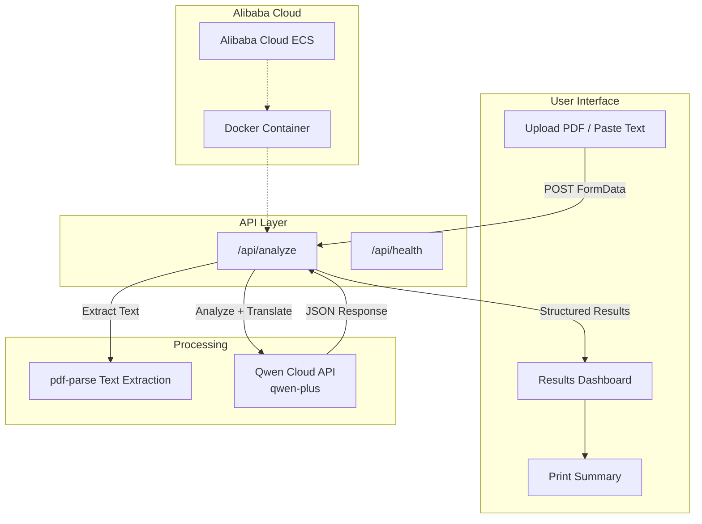

# Medlingo Architecture

## System Diagram

## Data Flow

1. **Upload**: Patient uploads a medical report (PDF or raw text)
2. **Extract**: `pdf-parse` extracts text content from the PDF
3. **Analyze**: Qwen Cloud (`qwen-plus`) receives the extracted text with a carefully engineered system prompt
4. **Translate**: Qwen generates plain-language explanations in English AND Hindi simultaneously
5. **Flag**: The system identifies critical/abnormal values and generates prominent alerts
6. **Display**: Results are shown in an accessible, calming healthcare-themed UI
7. **Print**: Patient can print a clean summary to take to their doctor
